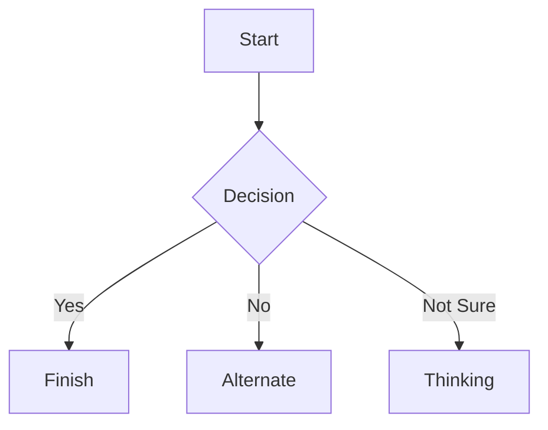

# Pautan yang berkaitan dengan buku dan git dan pdf dan markdown

## make ebook from markdown use html5 css3
## Membina e-buku daripada Markdown menggunakan HTML5 dan CSS3

* [Format Markdown untuk e-Buku (Kindle, Kobo dan Nook)](https://medium.com/@blittler/markdown-formatting-for-ebooks-including-kindle-kobo-and-nook-ee15a5992bc)
* [Menjana PDF Cantik dengan HTML, CSS dan Markdown](https://michaelnthiessen.com/create-beautiful-pdfs-with-html-css-and-markdown)
* [Cara Menghasilkan e-Buku daripada Markdown](https://flaviocopes.com/how-to-create-ebooks-markdown)
* [Menulis Buku Menggunakan Markdown](https://carlalexander.ca/write-book-markdown)
* [Github Markdown Css](https://github.com/sindresorhus/github-markdown-css)

___

# Contoh markdown dari [markdown live preview](https://markdownlivepreview.com)

------------- |:-------------:
title| Welcome to Markdown Viewer
description| Browser-based Markdown editor and viewer with live preview, GFM, diagrams, maps, STL previews, ABC notation, sharing, and export support.
author| ThisIs-Developer
tags: ["markdown", "live-preview", "gfm", "mermaid", "plantuml", "stl", "abc-notation", "open-source"]


## Blockquotes

> Markdown is a lightweight markup language with plain-text-formatting syntax, created in 2004 by John Gruber with Aaron Swartz.
>
>> Markdown is often used to format readme files, for writing messages in online discussion forums, and to create rich text using a plain text editor.

## Tables

| Left columns  | Right columns |
| ------------- |:-------------:|
| left foo      | right foo     |
| left bar      | right bar     |
| left baz      | right baz     |

## Blocks of code

```
let message = 'Hello world';
alert(message);
```

## Mermaid diagrams


## Inline code

This web site is using `markedjs/marked`.